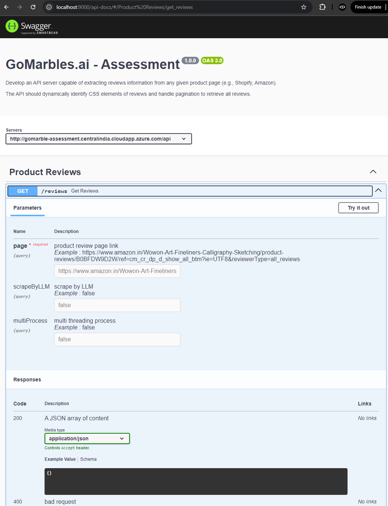
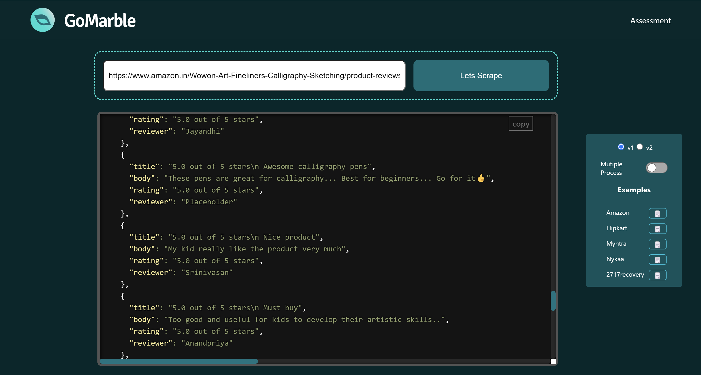

  - Assessment

## Objective

Develop an API server capable of extracting reviews information from any given product page (e.g., Shopify, Amazon). The API should dynamically identify CSS elements of reviews and handle pagination to retrieve all reviews.


## Table of Contents

- [Introduction](#introduction)
- [WorkFlow](#workflow)
- [Features](#features)
- [Installation](#installation)
- [API Reference](#api-reference)
- [Usage](#usage)
- [Deployment](#deployment)
- [FrontEnd](#frontend)


## Introduction

>This Node.js project utilizes Puppeteer for scraping review content from given product review URLs. Pagination is handled with custom logic and Gemini 1.5 Flash model (LLM) is used to dynamically detect CSS selectors for the required elements using a specific prompt. Two versions of the scraping process were implemented: one using CSS selectors and another utilizing the LLM to scrape the HTML block of review lists, filtered by selector detection.
Additionally, an optional multi-process handling feature is integrated using Node.js child processes to optimize scraping performance. API documentation is provided via Swagger, and an interactive frontend UI is built with React.js. Both the backend and frontend are successfully deployed on Azure.

## Workflow
   - Please have a look at Diagram   [download](https://drive.google.com/file/d/16xI4IUSYHIKe5KCHf8CZLpBJZ9DXw9AN/view?usp=drive_link)


 
   ## Steps followed 

   
   #### Steps 1 : User sends GET request with product Review Page URL
   #### Steps 2 : reviewController check query
   - if yes move child process review service and review service normal scraping
   #### Steps 3 : Start Scraping Function 
   #### Steps 4 : Clean HTML block and close common overlay/popups
   #### Steps 5 : Utilizing LLM to find selectors
   #### Steps 6 : Handling [pagination](#pagination) 
   #### Steps 7 : Return Json Data By selected version  
   #### Steps 8 : Response to User. 
   
   
   ### Pagination
   - Run loop in condition of next page / next button Exist .
   - Scrape the data for review block
   - Some pages wont show Ending NextButton
   - In that case i compare review block with last recent block if it matches it check for ( currentPageNo > Total Number Pages ) then it breaks loop
   - Return the collected after queryselect all innerText value by css selector
   
   
   

   


## Features

- Scrapping reviews from product review page [required product review page ]
- Gemini 1.5 Flash model (LLM) is used to dynamically detect CSS selectors
- [Two versions](#versions) of the scraping process [v1 and v2]
- Pagination is handled with custom logic
- Optional Feauture [Multi-process](#multi-process)  - handling feature is integrated using Node.js child processes.
- Interactive UI built with React.js
- Deployed Backend and made CI-CD by utilizing github actions .

## Installation

- To run Project locally, follow these steps:

1. Clone the repository:

    ```bash
    git clone https://github.com/Akhancode/be_gomarble_assessment.git
 
    ```
1. Go to the file:

    ```bash
    cd be_gomarble_assessment
    ```
2. Install dependencies:

    ```bash
    npm install 
    ```
3. Optional - if chrome doesnt exist please install dependency:

    ```bash
    npx puppeteer browsers install chrome
    ```
4. create a .env in root folder and paste variable :

    Get the Backend env secrets from  [here](https://drive.google.com/file/d/1I9onZH3cmeFcaOsPis1-FQkp-g6rguvL/view?usp=sharing). Kindly paste accordingly.
     
5. Run the application:

    ```bash
    npm start
    ```
    
## API Reference

</br>
  
</br>
The API documentation, including in Swagger docs, is available at **localhost:9000/api-docs** 
select the server in swagger accordingly 
Redirect to there for API details, testing endpoints .  </br>


- Deployed api  [Deployed server api doc ](http://gomarble-assessment.centralindia.cloudapp.azure.com/api-docs).

- Localhost api  [http://localhost:9000/api-docs](http://localhost:9000/api-docs)

 


## Usage
 - ### Versions
     Two Versions of Scrapping have been implemented
     - **v1**
           This version will scrape data utilizing relevant CSS selectors, which are identified by a language model (LLM) and by using puppeteer methods we scrape the data accordingly.
     - **v2**
           This version will utilize a large language model (LLM) to scrape data from the filtered html review block which is collected in format of array of review block .
           These block are identified by LLM in each iteration of looping of Pagination .

 - ### Multi-process
     Node.js operates on a single-threaded model, which can lead to performance bottlenecks. By utilizing child processes, web scraping tasks are delegated to separate processes, enhancing              performance and preventing blocking in the main application workflow.
     


## Project Structure
    BackendTask
    ├── README.md
    ├── nodemon.json
    ├── package-lock.json
    ├── package.json
    ├── server.js
    ├── singlepage_test.js
    ├── src
    │   ├── controllers
    │   │   └── reviews.controller.js
    │   ├── middleware
    │   │   └── monitor-api.js
    │   ├── model
    │   ├── routes
    │   │   ├── index.js
    │   │   └── reviews.route.js
    │   ├── services
    │   │   └── review.service.js
    │   ├── utils
    │   │   ├── constants
    │   │   │   └── testData.js
    │   │   ├── errors
    │   │   │   └── error.js
    │   │   ├── helper
    │   │   │   ├── helperFunction.js
    │   │   │   └── scraperHelperFunctions.js
    │   │   ├── llm
    │   │   │   └── helper.js
    │   │   └── prompts
    │   │       └── prompts.js
    │   └── workers
    │       └── scrapeWorker.js
    └── swagger.yaml
   


## Deployment

### PM2
Used PM2 is a process manager for Node.js applications. It helps keep your app running smoothly by automatically restarting it if it crashes.This manage multiple applications and monitor their performance easily.

### Nginx
Used Nginx is a web server that can also be used as a reverse proxy. It helps serve your application to users by handling incoming requests, distributing them to your Node.js app, and managing static files.

### GitHub Actions
Used GitHub Actions to automates workflows directly from your GitHub repository. You can set it up to automatically deploy your application whenever you push changes to your code, making the deployment process efficient and consistent ,Basically achieving CI CD .

### Azure VM
Used Azure Virtual Machine , It provides the resources needed to host your Node.js app.  ensuring that your application runs smoothly and efficiently.


## FrontEnd
   ### Repository for Front End [here](https://github.com/Akhancode/fe_gomarble_assessment). 
   


